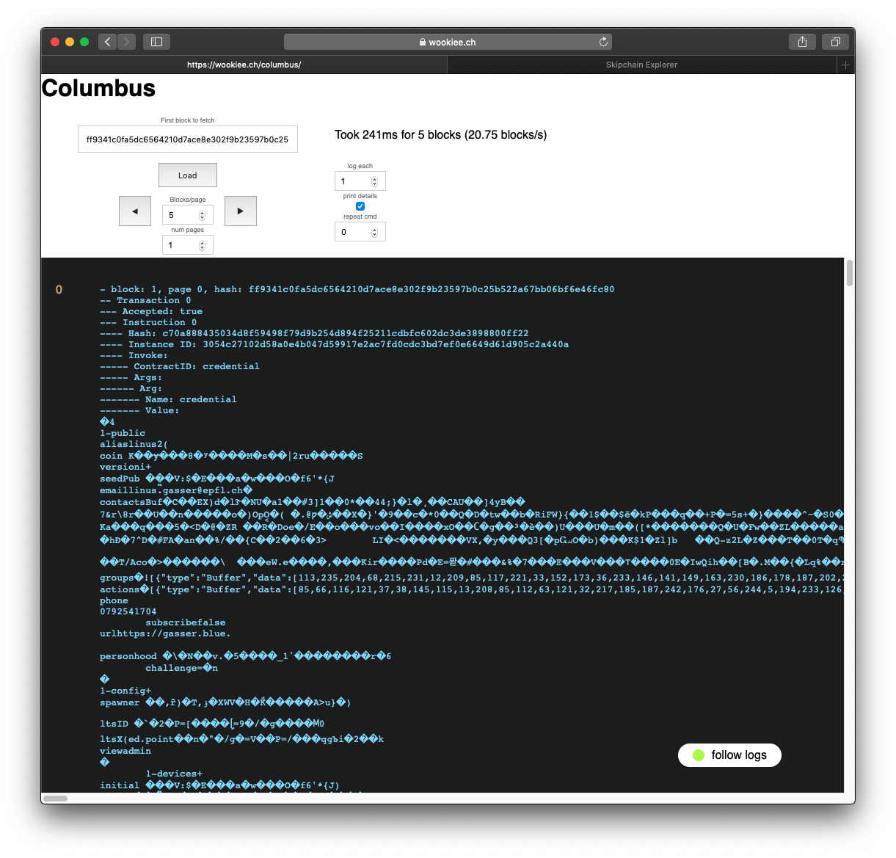

# columbus-cli


 Naive implementation of a Blockchain visualizer that works with cothority >= 3.4.3.

Run with `npm install && npm bundle`

[Play with it](https://wookiee.ch/columbus-cli/)

<div align="center">
    
</div>

## About Continuous Deployment (CD)

Each update on the `production` branch triggers a deployment on the production
server. Therefore, the produciton branch must only be used to make a new
deployment by updating it from the master branch with:

```bash
# Trigger a deployment:
git push origin master:production
```

Here is the simple setup we followed for continuous deployment:

**1**:

Create and set-up an ssh key so that Github can authenticate to the production
server:

```bash
ssh-keygen -t rsa -b 4096 -C "columbus-cli-rsync-github"
```

Add the private key as a secret from the repository setting with the DEPLOY_KEY
name (*Repository* > Settings > Secrets > New secret).

**2**:

Write the action that triggers an `rsync` upon changes on the production branch.
See `.github/workflows/deploy.yml`.

**3**:

Authorize the key on the server side to only execute rsync. Add in the
`~/.ssh/authorized_keys`:

```bash
command="rsync --server -vlogDtprc --delete . /var/www/wookiee.ch/public_html/columbus" ssh-rsa PUBLIC_SSH_KEY
```

**4**:

To make a deployment on the production server, update the production branch from
master with `git push origin master:production`.

This process is semi-automatic, as we know it's hard to maintain a 100% safe
master branch and it gives us more control on the deployment.
